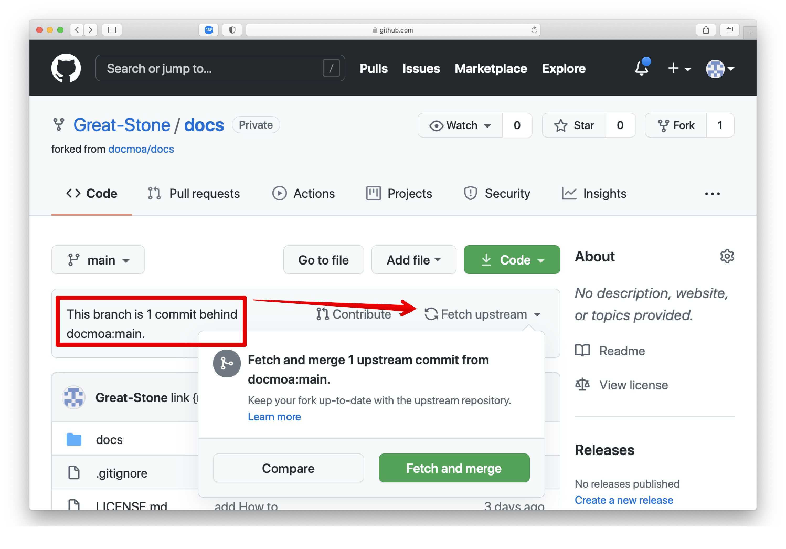
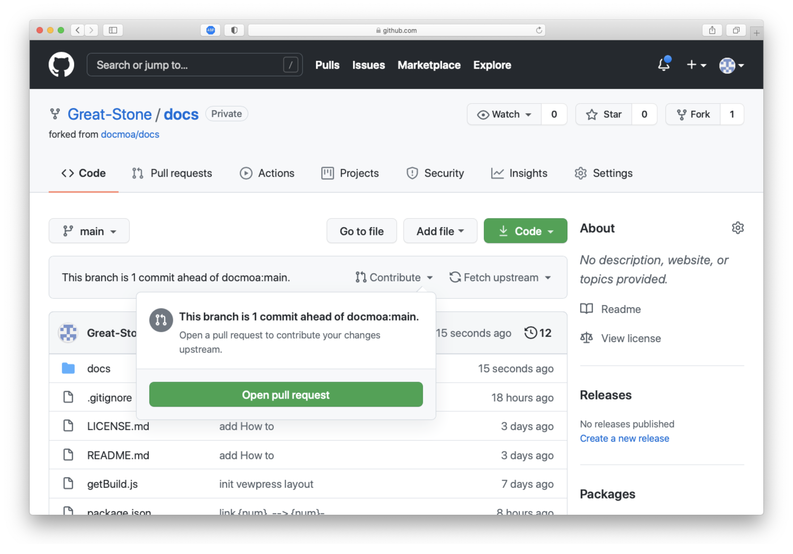
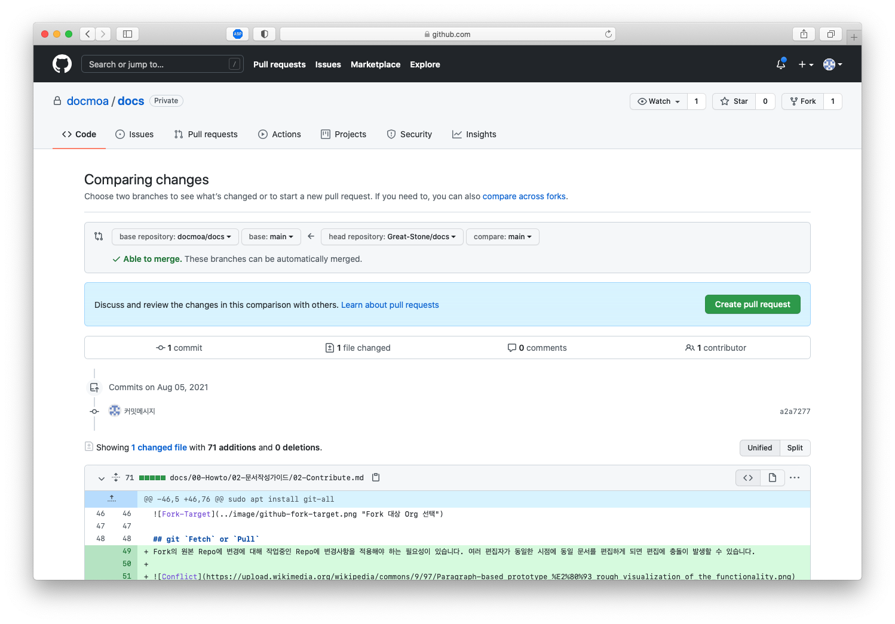

---


---

# Contribute

docmoa에 문서 기여하기위한 가이드를 설명합니다. 일반적인 github 상에서의 코드 기여 방식과 동일합니다.

## git 설치(Option)
로컬 환경에서 git 명령을 수행하기 위해 설치합니다. github 브라우저 환경에서 수정하는 것도 가능하지만, 로컬에서 문서를 활용하고 오프라인 작업을 위해서는 설치하시기를 권장합니다.

[Git 설치 방법 안내](https://git-scm.com/book/ko/v2/%EC%8B%9C%EC%9E%91%ED%95%98%EA%B8%B0-Git-%EC%84%A4%EC%B9%98)를 참고하여 아래 설명합니다.

:::: tabs
::: tab Mac
- Mavericks(10.9)부터는 Terminal에 단지 처음으로 'git’을 실행하는 것으로 설치가 시작됩니다.
- 공식 배포판 : <http://git-scm.com/download/mac> 에서 다운로드 받은 설치파일을 실행하여 설치합니다.
:::
::: tab Windows
- 공식 배포판 : <http://git-scm.com/download/win> 에서 다운로드 받은 설치파일을 실행하여 설치합니다.
- GitHub Desktop : [GitHub Desktop 웹사이트](https://desktop.github.com/)에서 내려받아 설치합니다.
:::
::: tab Linux(Fedora/RHEL/CentOS/Rocky)
```bash
sudo dnf install git-all
```
:::
::: tab Linux(Debian/Ubuntu)
```bash
sudo apt install git-all
```
:::
::::

## github `Fork`
문서는 github상에서 관리됩니다. 우선 문서를 추가구성하고 수정할 수 있도록 원본 github repo를 `Fork` 합니다.

1. `https://github.com/docmoa/docs`로 이동합니다.
2. 우측 상단의 `Fork`를 클릭하고 나의 github Org를 선택합니다.


## git `Fetch` or `Pull`
Fork의 원본 Repo에 변경에 대해 작업중인 Repo에 변경사항을 적용해야 하는 필요성이 있습니다. 여러 편집자가 동일한 시점에 동일 문서를 편집하게 되면 편집에 충돌이 발생할 수 있습니다.


참고 : <https://en.wikipedia.org/wiki/Edit_conflict>

충돌을 사전에 최대한 방지하기 위해서 편집 전에 원본의 문서를 가져오고 병합하는 과정이 필요합니다.

:::: tabs
::: tab CLI base
CLI 컨트롤을 위해서는 앞서 git 유틸 설치가 필요합니다.
```bash
# 1. Fork 받은 본인 소유의 Repo를 Clone 받습니다.
git clone https://github.com/docmoa/docs

# 2. 해당 소스 디렉토리로 이동하여 remote 를 확인합니다.
cd docs
git remote -v
origin	https://github.com/myorg/docs.git (fetch)
origin	https://github.com/myorg/docs.git (push)

# 3. 문서 원본 Repo와의 병합을 위해 `upstream` repo remote를 추가합니다.
git remote add upstream https://github.com/docmoa/docs

# 4-1. pull 을 수행하거나
git pull upstream main

# 4-2. fetch & merge 를 수행합니다.
git fetch upstream
git merge upstream/main
```
:::
::: tab UI base
원본 Repo에 변화가 있으면 UI상에서 상태가 알려집니다. 이 경우 우측의 `Fetch upstream` 을 통해 `Compare`로 변경사항을 확인하거나 `Fetch and merge`로 현재의 Repo에 병합할 수 있습니다.

:::
::::

## git `add` and `commit`
문서 작성은 앞서 [문서작성 '시작'](/00-Howto/02-Guide/01-Start.html)을 참고하세요. 문서 또는 문서 작성에 필요했던 이미지 등 준비가 끝나면 해당 파일을 본인 소유의 Repo에 추가합니다. 이 때 사용하는 것은 CLI도 가능하고, UI 기반에서 작성한 경우에는 저장 즉시 해당 Repo에 저장됩니다. Commit의 경우 필요에 따라 브랜치를 별도 생성하여 본인의 Repo를 기준으로 관리하는 것 또한 가능합니다.

:::: tabs
::: tab CLI base
CLI 컨트롤을 위해서는 앞서 git 유틸 설치가 필요합니다.
```bash
# 1. 작성한 파일을 git의 관리 대상으로 add 합니다.
git add path/문서.md

# 2. 로컬 Repo에서 변경사항을 Commit 합니다.
git commit -m "커밋메시지를 남깁니다.(예를들어 : 문서를 수정)"

# 3. 원격 Repo로 변경사항을 Push 합니다.
git push origin main
```
:::
::: tab UI base
github 웹 환경에서 문서를 추가하고 수정하는 것도 가능합니다.

:::
::::

## Contribute
최종적으로 Fork 한 Repo에 docmoa에 기여할 문서가 준비가 된경우 해당 Repo의 github ui에서 커밋된 정보가 있다는 문구와 `Contribute`를 클릭하여 `Pull request`를 진행 할 수 있습니다. `Open pull request`를 클릭하여 Upstream Repo에 요청을 보냅니다.



Pull request를 생성하면 본인 소유의 Repo(Branch)로 부터 docmoa에 지금까지의 변경사항을 병합할 것을 요청할 수 있습니다.
::: tip
상단에 표기되는 repo의 방향과 branch를 다시한번 확인해주세요.  
아래 어떤 항목이 어떻게 변경되는지 내용을 확인할 수 있습니다.
:::


`Create pull request` 버튼을 클릭하면 디테일한 설명을 추가할 수 잇습니다. 문서 자체의 변경사항만으로 의도를 전달하기 힘든경우 해당 설명이 이해하는데 큰 도움이 됩니다.


이제 Pull request가 받아들여지고나면 docmoa에 기여해주신 내용이 반영됩니다.

::: warning Build 주기
2021년 10월 4일 기준 매 5분마다 변경사항이 있으면 docmoa의 빌드가 수행됩니다.
:::