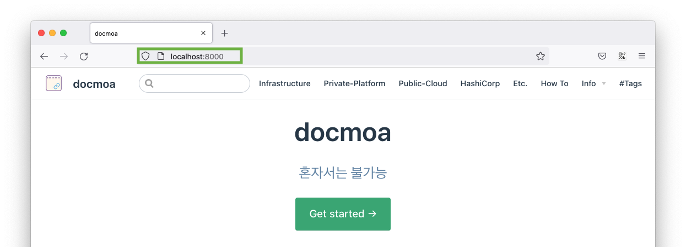

---

meta:
  - name: description
    content: 문서를 작성하는 방법을 안내
tags: ["how", "docmoa"]

---

# 문서작성 '시작'

docmoa에 문서 기여하기위한 가이드를 설명합니다. 

:::tip
다양한 방법으로 문서를 작성하고 기여할 수 있습니다.  
얽매이지 마세요.
:::

문서는 모두 git으로 관리되며 공개되어있습니다. [문서 기여를 위한 방식](/00-Howto/02-문서작성가이드/02-Contribute.html)은 별도 안내로 구분하여 설명합니다.
```bash
git clone https://github.com/docmoa/docs.git
```

또는 github에서 fork하여 별도 관리 후 pull request 하여도 좋습니다. 

## 디렉토리 구조 이해하기
clone 받은 구조는 VuePress의 구조를 갖고 있습니다. 문서의 기준이 되는 디렉토리는 `docs` 입니다.

::: vue
.
├── .gitignore
├── LICENSE.md
├── README.md
├── `docs`
│   ├── .vuepress
│   ├── 00-Howto
│   ├── 01-Infra
│   ├── 02-Private\ Platform
│   ├── 03-Public\ Cloud
│   ├── 04-HashiCorp
│   ├── 05-etc
│   ├── 98-tag
│   ├── 99-about
│   └── README.md
└── package.json
:::


### 기존 환경을 로컬에서 실행하고 확인하기
브라우저에서 보여지는 화면을 실시간으로 확인하기 위해 로컬환경에서 Vewpress를 실행합니다. Nodejs가 필요합니다.

<code-group>
<code-block title="NPM">
```bash {2,5-6,9}
# 클론 받은 디렉토리 이동 후 npm install
cd docs
npm install

# start VuePress writing
npm run dev
```
</code-block>

<code-block title="YARN">
```bash {2,5-6,9}
# 클론 받은 디렉토리 이동 후 npm install
cd docs
yarn install

# start VuePress writing
yarn vuepress dev
```
</code-block>
</code-group>

실행이 완료되면 로그에 다음과 같은 메시지와 접속할 수 있는 링크가 나타납니다.
::: vue
success [10:48:28] Build 6f9dd7 finished in 1179 ms! ( `http://localhost:8000/` )
:::

웹브라우저에서 실행시 표기되는 로그의 링크를 입력하면 공개된 웹화면과 동일한 환경을 확인할 수 있습니다.



### 문서 트리
`docs` 디렉토리 내에 기존에 구성된 항목 내에 작성도 가능하고 새로운 카테고리를 생성할 수도 있습니다. 디렉토리와 파일은 생성된 순서와 관계없이 정렬되기 때문에 좌측 `Sidebar` 표기시 원하는 순서대로 표기되기를 원하는 경우 `{숫자}-` 을 파일명 앞에 붙여 의도한대로 표시되도록 구성가능합니다.

예를 들어 `Howto`에 작성된 내용을 바탕으로 설명합니다.
::: vue
00-Howto
├── `01-docmoa활용가이드.md`
├── `02-문서작성가이드`
│   ├── 01-Start.md
│   ├── 02-PullRequest.md
│   └── 03-Fork.md
├── `03-문서작성팁`
│   ├── CodeBlock.md
│   ├── Link.md
│   └── TipBox.md
└── `README.md`
:::
- 파일과 디렉토리 구분없이 같은 Depth에 위치하는 경우 함께 표기 됩니다.
  - 01.docmoa활용가이드.md (파일)
  - 02.문서작성가이드 (디렉토리)
  - 03.문서작성팁 (디렉토리)
- README.md는 `index.html`과 같이 해당 디렉토리의 기본 페이지로 등록됩니다. 디렉토리 경로만 입력하는 경우 해당 페이지가 나타납니다. 
  - 요청하는 페이지 경로 : `https://docmoa.github.io/00-Howto/`
  - 실제하는 페이지 경로 : `https://docmoa.github.io/00-Howto/README.md`

:::warning 디렉토리 이름
디렉토리 이름에 공백이 있는 경우 다른 문서에서 참조 시 공백 문자인 `%20` 를 표기해야 하는 이슈가 발생할 수 있습니다.  
```md
[](https://docmoa.github.io/00-Howto/공백이%20있는%20디렉토리)
```
:::

## 첫번째 글 쓰기
여기서는 `SSH Too many authentication failures` 와 관련한 간단한 글을 개시하는 것을 예로 설명하겠습니다.
실제 VuePress 환경으로 어떤 내용이 표기되는지 동적인 확인을 위해 앞서 [기존 환경을 로컬에서 실행하고 확인하기](/00-Howto/02-문서작성가이드/01-Start.html#기존-환경을-로컬에서-실행하고-확인하기)에서 처럼 화면을 띄우고 작업하면 실제 작성하는 글들이 어떻게 보여지는지도 함께 확인할 수 있습니다.

1. `Linux` 카테고리로 가정하고 `01.Infra > Linux > TroubleShooting` 이라는 디렉토리를 생성합니다.
2. 문서 작성을 위한 `SSH Too many authentication failures.md` 파일을 생성합니다.
    - 파일 이름과는 별개로 본문상의 `Title`이 메뉴에 표기됩니다.
3. 문서 내용에는 문서 기본 서문(Frontmatter)을 작성하기 위한 `---`로 구성된 블록이 최상단에 명시됩니다. 내용은 기존 마크다운 문서를 작성하는 것과 동일하게 구성합니다.
    ```md
    ---

    meta:
      - name: description
        content: SSH Too many authentication failures
    author : "내이름"
    tags: ["linux", "ssh"]

    ---

    # SSH Too many authentication failures (제목인 Title은 h1 스타일로)

    너무많은 인증 실패로 인한 SSH 접속이 안되는 메시지를 간혹 보게되는 경우가 있다.
    <생략>
    ```

    - 참고할 기본 포맷 내용은 [기본 문서 포맷]() 설명에서 확인할 수 있습니다.


## 내가 쓴 문서를 docmoa에 개시 요청하기
작성한 문서를 docmoa에 기여하는 방법은 다음 [Contribute](/00-Howto/02-문서작성가이드/02-contribute.html) 항목에서 설명합니다.
