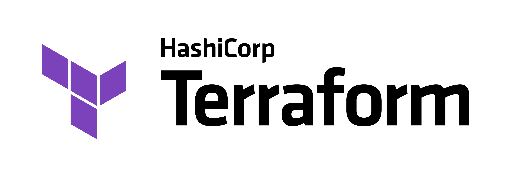

---
meta:
  - name: description
    content: Naver Cloud Platform에서의 Terraform 실습
tags: ["ncloud", "ncp", "terraform", "workshop"]

---

# 02. 테라폼 기본

## Terraform 이란?



- Terraform은 오픈 소스 프로비저닝 도구입니다.
  - Terraform Github : <https://github.com/hashicorp/terraform>

- Go로 작성된 단일 바이너리로 제공됩니다. Terraform은 크로스 플랫폼이며 Linux, Windows 또는 MacOS에서 실행할 수 있습니다.

- terraform 설치는 쉽습니다. zip 파일을 다운로드하고 압축을 풀고 실행하기 만하면됩니다.
  - 다운로드 : <https://www.terraform.io/downloads.html>

## Terraform Command Line

- 기본적으로 Terraform 오픈소스는 커맨드라인 도구입니다.

- Terraform 명령은 수동으로 입력하거나 스크립트에서 자동으로 실행됩니다.

- 명령은 Linux, Windows 또는 MacOS에 상관없이 동일합니다.

- Terraform에는 다른 작업을 수행하는 하위 명령들이 있습니다.

```bash
# Basic Terraform Commands
terraform version
terraform help
terraform init
terraform plan
terraform apply
terraform destroy
```

## Terraform Help

```bash {1}
$ terraform help
Usage: terraform [-version] [-help] <command> [args]
...
Common commands:
    apply              Builds or changes infrastructure
    console            Interactive console for Terraform interpolations
    destroy            Destroy Terraform-managed infrastructure
    env                Workspace management
    fmt                Rewrites config files to canonical format
    graph              Create a visual graph of Terraform resources
```

특정 하위 명령에 대한 도움말을 보려면 `terraform <subcommand> help` 를 입력합니다.

## Terraform Code

```hcl
resource "ncloud_vpc" "vpc" {
    ipv4_cidr_block = "10.0.0.0/16"
}
```

Terraform 코드는 [HCL2 툴킷](https://github.com/hashicorp/hcl)을 기반으로합니다. HCL은 HashiCorp Configuration Language를 나타냅니다.

Terraform 코드는 모든 클라우드 또는 플랫폼에서 인프라를 프로비저닝하기 위해 특별히 설계된 선언적 언어입니다.

## Terraform Comments

줄 주석은 `*`(octothorpe, 별표) 또는 `#`(파운드) 기호로 시작합니다....==샵! #==

```hcl
# This is a line comment.
```

블록 주석은 `/*`와 `*/` 기호 사이에 포함됩니다.

```hcl
/* This is a block comment.
Block comments can span multiple lines.
The comment ends with this symbol: */
```

## Terraform Workspaces

Workspace는 Terraform 코드가 포함 된 폴더 또는 디렉토리입니다.

Terraform 파일은 항상* .tf 또는* .tfvars 확장자로 끝납니다. 실행 시 해당 파일들은 하나로 동작합니다.

대부분의 Terraform Workspaces에는 일반적으로 아래 3개정도의 파일을 둡니다. (정해진건 아닙니다.)

- main.tf - 대부분의 기능 코드는 여기에 있습니다.
- variables.tf - 이 파일은 변수를 저장하기위한 것입니다. 
- outputs.tf - 테라 폼 실행 후 표시되는 내용을 정의합니다.

## Terraform Init

```hcl {1}
$ terraform init
Initializing the backend...

Initializing provider plugins...
- Finding navercloudplatform/ncloud versions matching ">= 2.1.2"...
- Installing navercloudplatform/ncloud v2.1.2...
- Installed navercloudplatform/ncloud v2.1.2 (signed by a HashiCorp partner, key ID 9DCE24305722E9C9)
...
Terraform has been successfully initialized!
```

Terraform은 필요한 Provider(공급자)와 Module(모듈)을 가져와 `.terraform` 디렉터리에 저장합니다. 모듈 또는 공급자를 추가, 변경 또는 업데이트하는 경우 init를 다시 실행해야합니다.

## Terraform Plan

```bash {1}
$ terraform plan
...
Terraform will perform the following actions:

  # ncloud_vpc.vpc will be created
  + resource "ncloud_vpc" "vpc" {
      + default_access_control_group_no = (known after apply)
      + default_network_acl_no          = (known after apply)
      + default_private_route_table_no  = (known after apply)
      + default_public_route_table_no   = (known after apply)
      + id                              = (known after apply)
      + ipv4_cidr_block                 = "10.0.0.0/16"
      + name                            = (known after apply)
      + vpc_no                          = (known after apply)
    }

Plan: 1 to add, 0 to change, 0 to destroy.
```

변경 사항을 적용하기 전에 `terraform plan` 으로 미리 구성의 변경을 살펴봅니다.

## 변수는 어디에?

Terraform 변수는 `variables.tf`라는 파일에 일반적으로 위치 시킵니다.(이름은 변경 가능) 변수는 기본 설정을 가질 수 있습니다. 기본값을 생략하면 사용자에게 값을 입력하라는 메시지가 표시됩니다. 여기서 우리는 사용하려는 변수를 ==선언== 합니다.

```hcl
variable "prefix" {
  description = "This prefix will be included in the name of most resources."
}

variable "vpc_cidr" {
  description = "A cidr option for instances into the VPC."
  default     = "10.0.0.0/16"
}
```

## 변수에 값을 할당하는 방식과 우선순위

일부 변수를 정의한 후에는 다른 방법으로 설정하고 재정의 할 수 있습니다. 다음은 각 방법의 우선 순위입니다.

이 목록은 가장 높은 우선 순위 (1)에서 가장 낮은 순위 (5)로 나타냅니다.

즉, CLI 실행시 `-var` 로 지정되는 `Command line flag`가 가장 우선합니다.

1. Command line flag - 명령 줄 스위치로 실행
2. Configuration file - terraform.tfvars 파일에 설정
3. Environment variable - 쉘 환경의 일부
4. Default Config - variables.tf의 기본값
5. User manual entry - 지정되지 않은 경우 사용자에게 입력을 요청합니다.

## Terraform Basic 리뷰

이 장에서 우리는 다음을 학습하였습니다.

- terraform init 명령
- terraform plan 명령
- 변수에 대해 배웠습니다.
- prefix(접두사) 설정

실습을 위해 다음장으로 이동하세요.

[:computer: Lab - Setup and Basic Usage](./02-z-lab_terraform_basic.html)