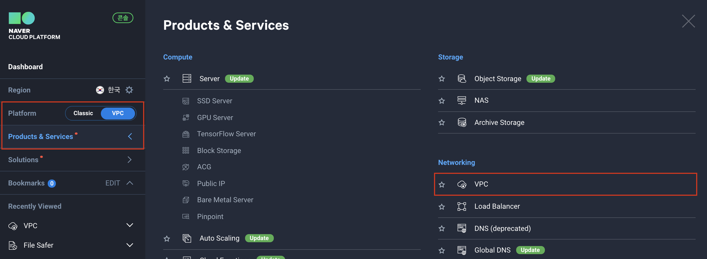
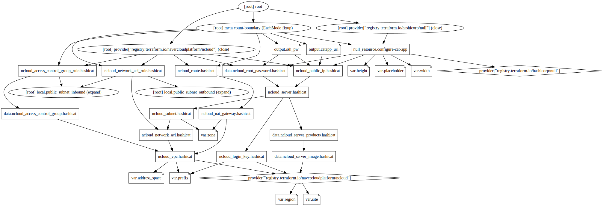

# :computer: Lab - Terraform in Action

### 편집기에서 열기


- VSCode를 실행하고 File(파일) 메뉴에서 `Open Folder...` 를 클릭합니다.
- 앞서 받은 디렉토리내의 `lab02`을 열어줍니다.

---

## 📈 Terraform Graph

@slidestart blood

### Terraform Graph는 모든 인프라에 대한 시각적 표현을 제공할 수 있습니다.

---

### 이는 변경의 영향을 받을 종속성 문제 또는 리소스를 찾는 데 유용합니다.

@slideend

:computer: 다음 terraform graph명령을 실행해 보세요.

새로운 Workspace 이므로, `terraform init`을 수행합니다.

```bash
terraform init
```

`terraform graph`를 수행합니다.

```bash
terraform graph
```

그러면 `digraph`로 시작하는 인프라의 시각적 맵을 만드는 데 사용할 수 있는 코드가 생성됩니다. 그래프 데이터는 DOT 그래프 설명 언어 형식 입니다. 무료 Blast Radius 도구를 포함하여 이 데이터를 시각화하는 데 사용할 수 있는 몇 가지 그래프 도구가 있습니다.

- [Blast Radius](https://28mm.github.io/blast-radius-docs/)는 설치형 툴입니다.
- Graphviz는 DOT 그래프 설명 언어를 표시해주는 툴입니다.
  - <https://dreampuf.github.io/GraphvizOnline/> 에 앞서 `digraph`로 시작하는 내용을 복사하여 붙여넣고 어떤 그림이 나오는지 확인해 봅니다.
  - 인프라에 대한 Terraform 그래프를 살펴보십시오. 종속성이 자동으로 매핑됩니다.
  

온라인에 Terraform의 작업을 시각화해주는 여러가지 툴이 있습니다. 간혹 plan 파일을 요구하는 툴이 있다면 주의하십시오. 민감한 정보가 포한된 plan의 경우 보안적으로 위험할 수 있습니다. 주의하여 사용하세요.

- <https://hieven.github.io/terraform-visual/>

::: warning
plan 정보에는 인증키, 패스워드같은 노출하고 싶지 않은 정보가 포함될 수 있습니다.
:::

---

## 👨‍💻 Terraform Plan & Terraform Apply

@slidestart blood

### 기본적으로 `terraform apply` 명령은 `Terraform Plan`을 실행하여 원하는 변경 사항을 보여줍니다.

---

### 이는 변경의 영향을 받을 종속성 문제 또는 리소스를 찾는 데 유용합니다.

@slideend

#### :computer: 필수 변수를 구성했으므로 변경 사항을 적용할 수 있습니다.

어떤 일이 일어날지 보려면 먼저 `terraform plan` 명령을 실행하십시오 .

```bash
terraform plan
```

계획 출력에 적절한 prefix, subnet cidr이 표시되는지 확인합니다. 원한다면 `terraform.tfvars` 혹은 `variables.tf`에 정의된 `default`값을 변경해보세요.

그런 다음 `terraform apply`를 실행하고 리소스가 구축되는 것을 지켜보십시오.

```bash
terraform apply
```

Terraform에서 "Do you want to perform these actions?"라는 메시지가 표시되면 `yes` 를 입력해야 합니다.

`Apply complete! Resources: 1 added, 0 changed, 0 destroyed.` 메시지를 확인하였습니까? 에러가 발생하였다면 무엇이 문제인지 찾아보세요.

지금 우리 코드는 VPC만 정의합니다. 우리는 진행되는 실습에서 이 코드와 프로비저닝된 상태 기반으로 시작 할 것입니다.

[NCP Consul](https://console.ncloud.com/vpc-network/vpc) 화면에 접속해 보세요. 구성한 자원이 생성된 것이 확인되나요?

:::: tabs
::: tab 1. Products & Services

:::
::: tab 2. VPC

:::
::::

---

## 👩‍💻 Test and Repair

@slidestart blood

### Terraform은 멱등성(idempotent)을 갖습니다.

---

멱등은 수학 및 컴퓨터 과학의 특정 연산의 속성으로, 초기 적용을 넘어 동일하다면 결과를 변경하지 않고 여러 번 적용할 수 있습니다.  
참고 : <https://en.wikipedia.org/wiki/Idempotence>

@slideend

#### :computer: 멱등성의 검증을 해봅니다.

어떤 일이 일어날지 보려면 먼저 `terraform plan` 명령을 실행하십시오.

```bash
terraform plan
```

VPC가 이미 구축되었으므로 Terraform은 변경이 필요하지 않다고 보고합니다.

이는 정상적이며 예상된 것입니다. 이제 다른 명령인 `terraform apply`를 실행하고 지켜보십시오.

```bash
terraform apply
```

이미 올바르게 프로비저닝된 경우 VPC를 다시 생성하지 않습니다.

`Apply complete! Resources: 0 added, 0 changed, 0 destroyed.`


## 🛫 Change Your Prefix

@slidestart blood

### Terraform은 인프라를 Create, Destroy, Update, re-Create 합니다.

---

### 리소스 내용 변경 시
- 일부 유형의 리소스는 내용 변경 시 삭제하지 않고 업데이트할 수 있습니다.
- 또 어떤 경우는 Destroy 후 Create 되는 과정이 발생합니다.

---

Terraform은 항상 현재 인프라를 코드에 정의된 것과 일치시키려고 합니다.

@slideend

#### :computer: `terraform.tfvars`를 변경합니다.

`terraform.tfvars` 파일을 편집하여 `prefix`를 기존과 다른 값으로 변경합니다. 

변경 후 `terraform apply`를 실행하고 지켜보십시오.

```bash
terraform plan
```

VPC가 이미 구축되었으므로 Terraform은 변경이 필요하지 않다고 보고합니다.

이는 정상적이며 예상된 것입니다. 이제 다른 명령인 `terraform apply`를 실행하고 지켜보십시오.

```bash
terraform apply
```

Terraform에서 "Do you want to perform these actions?"라는 메시지가 표시되면 `yes`를 입력하고 완료되기를 기다립니다. 출력의 결과가 어떤가요?

::: details VPC Update
2021년 10월 20일 기준으로, VPC의 이름이 변경되면 NCP에서는 이 자원을 재생성 합니다.
리소스에 대한 구성값의 변경이 유지된 채로 변경되기도 하지만, 때에 따라서는 삭제 후 재생성 합니다.

```bash {1}
$ terraform apply
ncloud_vpc.hashicat: Refreshing state... [id=13888]

Terraform used the selected providers to generate the following execution plan.
Resource actions are indicated with the following symbols:
-/+ destroy and then create replacement

Terraform will perform the following actions:

  # ncloud_vpc.hashicat must be replaced
-/+ resource "ncloud_vpc" "hashicat" {
      ~ default_access_control_group_no = "26594" -> (known after apply)
      ~ default_network_acl_no          = "19325" -> (known after apply)
      ~ default_private_route_table_no  = "25834" -> (known after apply)
      ~ default_public_route_table_no   = "25833" -> (known after apply)
      ~ id                              = "13888" -> (known after apply)
      ~ name                            = "yourname-vpc-kr" -> "hashicat-vpc-kr" # forces replacement
      ~ vpc_no                          = "13888" -> (known after apply)
        # (1 unchanged attribute hidden)
    }

Plan: 1 to add, 0 to change, 1 to destroy.

Do you want to perform these actions?
  Terraform will perform the actions described above.
  Only 'yes' will be accepted to approve.

  Enter a value: yes

ncloud_vpc.hashicat: Destroying... [id=13888]
ncloud_vpc.hashicat: Still destroying... [id=13888, 10s elapsed]
ncloud_vpc.hashicat: Still destroying... [id=13888, 20s elapsed]
ncloud_vpc.hashicat: Destruction complete after 23s
ncloud_vpc.hashicat: Creating...
ncloud_vpc.hashicat: Still creating... [10s elapsed]
ncloud_vpc.hashicat: Still creating... [20s elapsed]
ncloud_vpc.hashicat: Creation complete after 23s [id=13902]

Apply complete! Resources: 1 added, 0 changed, 1 destroyed.
```
:::

---

## 🛫 Create and Change ACL

@slidestart blood

### Terraform은 인프라를 Create, Destroy, Update, re-Create 합니다.

---

### 리소스 내용 변경 시
- 일부 유형의 리소스는 내용 변경 시 삭제하지 않고 업데이트할 수 있습니다.
- 또 어떤 경우는 Destroy 후 Create 되는 과정이 발생합니다.

---

### Terraform은 항상 현재 인프라를 코드에 정의된 것과 일치시키려고 합니다.

---

### Terraform 코드는 한 번에 하나 또는 두 개의 리소스를 사용하여 점진적으로 빌드할 수 있습니다.

@slideend

#### :computer: `ncloud_network_acl`을 추가합니다.

`main.tf` 파일을 열고 리소스 블록의 주석처리를 제거하려고 합니다.  
리소스 유형은 `ncloud_network_acl`이고 이름은 `public` 입니다.

- 각 줄의 시작 부분에서 `#` 문자를 제거하여 코드의 주석 처리를 제거합니다.

- 코드편집기에서는 주석처리를 위해 해당 라인을 선택하고 활성/비활성 할 수 있습니다.

  -  Mac : <kbd>⌘</kbd> + <kbd>/</kbd>

  -  Win : <kbd>Ctrl</kbd> + <kbd>/</kbd>
  

- 주석 제거 후 파일을 저장하세요.


변경 후 `terraform apply`를 실행하고 `yes`를 입력하여 추가된 리소스가 생성되는지 확인하세요.

`ncloud_network_acl`리소스 내부의 `vpc_no` 파라메터를 확인합니다. 어떻게 가르키고 있나요?

해당 리소스는 VPC의 설정을 상속 받습니다.

Terraform은 수백개의 상호 연결되 리소스 간의 복잡한 종송석을 맵핑할 수 있습니다.

#### :computer: `ncloud_network_acl`을 설정을 변경합니다.

`ncloud_network_acl`항목에 대해 `description` 의 내용을 수정해 보세요.

```hcl {4}
resource "ncloud_network_acl" "public" {
  vpc_no      = ncloud_vpc.hashicat.id
  name        = "${var.prefix}-acl-public"
  description = "for Public"
}
```

변경 후 `terraform apply`를 실행하고 `yes`를 입력하여 변경된 사항에 대해 리소스가 어떻게 되는지 확인하세요.

올바르게 프로비저닝된 경우 `ncloud_network_acl`를 삭제 후 다시 생성하지 않습니다.

`Apply complete! Resources: 0 added, 1 changed, 0 destroyed.`

---

## 🏗️ Complete the Build

@slidestart blood

### `-auto-approve` 플래그
해당 플래그를 사용하여 "Do you want to perform these actions?" 에 한 질문을 오버라이드(Override) 할 수 있습니다.

---

### 사용에 주의가 필요하니다.
검토 단계인 Plan을 건너뛰고 바로 Create/Update/Destroy 합니다.

@slideend

#### :computer: 애플리케이션을 배포해보세요.

- `main.tf`의 모든 주석을 제거하세요.
- `outputs.tf`의 모든 주석을 제거하세요.

`terraform plan`를 실행하여 구성할 리소스 항목을 확인합니다.

```bash
terraform plan
```

이제 Apply를 실행하여 HashiCat 애플리케이션을 빌드합니다.

```bash
terraform apply -auto-approve
```

애플리케이션이 배포를 완료하는데 5~10분이 소요될 수 있습니다. 실행이 끝날 때 애플리케이션 URL이 포함된 Terraform 출력을 보면 완료되었음을 알 수 있습니다.

`catapp_url` 출력 에서 URL을 클릭하여 새 브라우저 탭에서 웹 애플리케이션을 엽니다.

::: warning
응용 프로그램이 로드되지 않으면 `terraform apply` 다시 실행 하십시오. 이렇게 하면 웹 서버를 다시 설치하고 실행 중이 아닌 경우 응용 프로그램을 시작하려고 합니다.
:::

#### :computer: 변경된 사항을 확인하기 위해 그래프를 다시 살펴봅니다.

terraform graph를 수행합니다.

```bash
terraform graph
```

<https://dreampuf.github.io/GraphvizOnline/>에 앞서 digraph로 시작하는 내용을 복사하여 붙여넣고 어떤 그림이 나오는지 확인해 봅니다.



인프라에 대한 Terraform 그래프를 살펴보십시오. 종속성이 자동으로 매핑됩니다. 

Terraform은 이 그래프를 사용하여 최대 효율성을 위해 병렬로 구축할 수 있는 리소스를 결정합니다.

---

## :scream: Quiz Time 3. Terraform Apply

Q. Plan 파일을 지정하지 않고 terraform apply를 실행하면 어떻게 됩니까?

- [ ] Terraform은 Plan 없이 실행됩니다.
- [ ] Terraform은 이전 Plan을 읽고 적용합니다.
- [ ] Terraform은 적용 직전에 새로운 Plan을 실행합니다.
- [ ] 모두 틀림

::: details 답
- [x] Terraform은 적용 직전에 새로운 Plan을 실행합니다.
:::

---

이 장에서 우리는 :
- Terraform 리소스에 대해 배웠습니다.
- Terraform Plan, Graph, Apply, Destory
- 종속성에 대해 배웠습니다.
- 실습에서 그래프를 확인해보았습니다.
- main.tf, variables.tf, outputs.tf를 살펴보았습니다.
- Meow World 애플리케이션을 구축하였습니다.