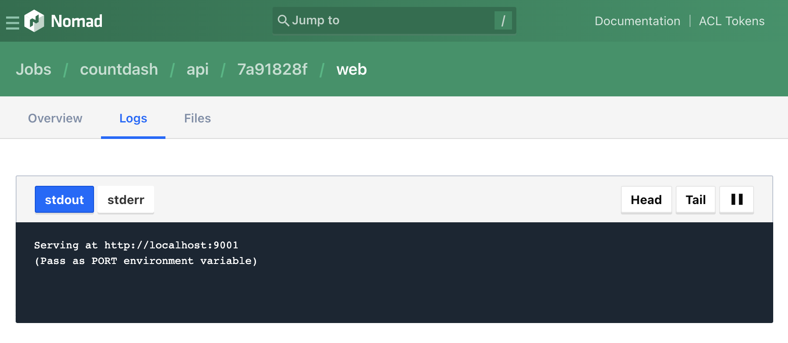
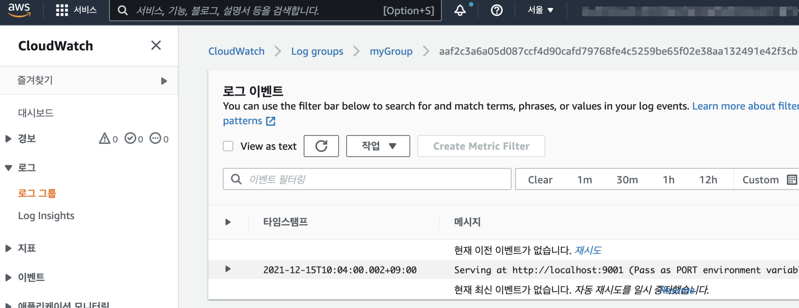

---
meta:
  - name: description
    content: Nomad docker job logging into Cloudwatch
tags: ["Nomad", "AWS", "Cloudwatch", "log"]
---

# Docker log driver and Cloudwatch on Nomad

docker 런타임에는 log driver로 "awslogs"를 지원합니다.
<https://docs.docker.com/config/containers/logging/awslogs/>

::: tip
Nomad에서 docker 자체의 로깅을 사용하므로서, Nomad에서 실행되는 docker 기반 컨테이너의 로깅이 특정 환경에 락인되는것을 방지합니다.
:::

::: warning
AWS 환경이 아닌 외부 구성 시, 해당 노드에 Cloudwath 기록을 위한 Policy를 갖는 IAM의 credential 정보가 환경변수 또는 `~/.aws/credential` 구성이 필요합니다.
:::

## EC2 Instance Role 구성

Nomad 구성 시 Cloudwatch에 대한 EC2 Instance의 IAM 구성이 필요합니다. 아래 구성의 예를 참고하세요.
- loging driver의 구성에 따라 `aws_iam_role_policy`에 설정하는 필요한 권한에 차이가 있을 수 있습니다.
- 예를 들어 docker loging 구성에서 `awslogs-create-group = true` 옵션을 추가하려는 경우 `logs:CreateLogGroup` 정책이 필요합니다.
- 권한에 대한 상세 설명은 다음 링크를 참고합니다. <https://docs.aws.amazon.com/ko_kr/AmazonCloudWatch/latest/logs/permissions-reference-cwl.html>

```hcl {35-37,54}
## 생략 ##

resource "aws_iam_instance_profile" "ec2_profile" {
  name = "ec2_profile"
  role = aws_iam_role.role.name
}

resource "aws_iam_role" "role" {
  name = "my_role"

  assume_role_policy = jsonencode({
    Version = "2012-10-17"
    Statement = [
      {
        Action = "sts:AssumeRole"
        Effect = "Allow"
        Sid    = ""
        Principal = {
          Service = "ec2.amazonaws.com"
        }
      },
    ]
  })
}

resource "aws_iam_role_policy" "cloudwatch_policy" {
  name        = "cloudwatch_policy"
  role        = aws_iam_role.role.id
  
  policy = jsonencode({
    Version = "2012-10-17"
    Statement = [
      {
        Action = [
          "logs:CreateLogStream",
          "logs:PutLogEvents",
          "logs:CreateLogGroup"
        ]
        Effect   = "Allow"
        Resource = "*"
      },
    ]
  })
}

resource "aws_instance" "example" {
  ami           = "ami-04e6fcf8cfe3b09ea"
  instance_type = "t2.micro"
  key_name      = aws_key_pair.web_admin.key_name
  vpc_security_group_ids = [
    aws_security_group.ssh.id
  ]

  iam_instance_profile = aws_iam_instance_profile.ec2_profile.name
}
```

## Nomad Job의 Docker Driver에 Logging 설정

Nomad에서 docker 드라이버 사용시 적용되는 기본 log driver는 `json-file` 입니다. 추가 설정을 통해 docker가 지원하는 다양한 log driver를 사용할 수 있습니다. ([FluentD 샘플](https://www.nomadproject.io/docs/drivers/docker#logging))
- 구성에 필요한 정보는 Docker의 공식 문서를 참고 합니다. : <https://docs.docker.com/config/containers/logging/configure/>
- 기존 docker cli 상에 구성했던 `--log-driver` 같은 옵션의 정의가 HCL형태로 정의됩니다.
- HCL 문법을 따르므로, 몇몇 상이한 표현방식이 있을 수 있습니다. 예를들어 로그 날짜 구성에 사용되는 `"\[%Y-%m-%d\]"` 에서 `[` 같은 특수문자 표기를 위해 `\`를 한번만 넣었다면, `"\\[%Y-%m-%d\\]"` 같이 두번 넣어야 할수도 있습니다.

구성 예제는 아래와 같습니다.

```hcl {26-34}
job "api" {
	datacenters = ["dc1"]
  type = "service"

  group "api" {
    network {
      mode = "bridge"
      port "api" {
        to = 9001
      }
    }

    service {
      name = "count-api"
      port = "api"
      connect {
        sidecar_service {}
      }
    }

    task "web" {
      driver = "docker"
      config {
        image = "hashicorpnomad/counter-api:v1"
        ports = ["api"]
        logging {
          type = "awslogs"
          config {
            awslogs-region = "ap-northeast-2"
            awslogs-group = "myGroup"
            awslogs-create-group = true
            awslogs-datetime-format = "\\[%Y-%m-%dT%H:%M:%S\\+09:00\\]"
          }
        }
      }
    }
  }
}
```

## Log 확인

Nomad의 로그 출력을 확인합니다.


Cloudwatch에 로그 출력을 확인합니다.
