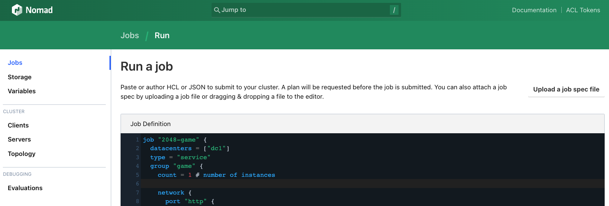

# Pass HCL to API

HCL로 작성된 Job의 경우 Nomad CLI 또는 UI 접속이 가능하다면 바로 적용 가능하다.

::: details HCL Job Sample (2048.hcl)
```hcl
job "2048-game" {
  datacenters = ["dc1"]
  type        = "service"
  group "game" {
    count = 1 # number of instances

    network {
      port "http" {
        static = 80
      }
    }

    task "2048" {
      driver = "docker"

      config {
        image = "alexwhen/docker-2048"

        ports = [
          "http"
        ]

      }

      resources {
        cpu    = 500 # 500 MHz
        memory = 256 # 256MB
      }
    }
  }
}
```
:::

```bash
nomad job run 2048.hcl
```



하지만 CLI/UI를 사용할 수 없는 환경에서 API를 사용하여 Job을 실행해야하는 경우, 특히 CICD Pipeline구성에서 API를 사용하여 Job을 실행해야하는 경우 HCL을 Json 형식으로 변경해야하는 경우가 있다.

## HCL parse to Json

HCL을 Json으로 변경하는 방식의 첫번째는 CLI를 사용하는 방식이다.

```bash
nomad job run -output 2048.hcl > payload.json
```

하지만 이 경우 `-output`을 입력하지 않는 경우 Job이 실행되는 실수의 여지가 있고, CLI가 없다면 사용 불가하다.

다음은 API를 사용하는 방식이다.
> Parsh Job : <https://developer.hashicorp.com/nomad/api-docs/jobs#parse-job>

문서의 내용처럼 HCL을 한줄로 변경하여 API로 요청하면 Json으로 형태를 출력해준다.

### Sample Payload
```json
{
  "JobHCL": "job \"example\" {\n  type = \"service\"\n  group \"cache\" {}\n}",
  "Canonicalize": true
}
```

HCL을 한줄로 변경하기 까다롭거나 별도의 도구가 없다면 `jq`를 활용한 방식도 가이드하고 있다.

```bash
jq -Rsc '{ JobHCL: ., Canonicalize: true }' example.nomad.hcl > payload.json
```

### Sample Request

`/v1/jobs/parse` 엔드포인트로 `payload.json` 데이터를 담아 요청한다.

```bash
curl \
    --request POST \
    --data @payload.json \
    https://localhost:4646/v1/jobs/parse
```

### Sample Response

Json으로 변경된 값을 반환한다.

```json
{
  "AllAtOnce": false,
  "Constraints": null,
  "Affinities": null,
  "CreateIndex": 0,
  "Datacenters": null,
  "ID": "my-job",
```

## HCL로 작성된 Job을 API로 실행하기

API가 제공하는 Json Parse를 사용, 다음과 같은 순서로 Job을 실행할 수 있다.

```mermaid
sequenceDiagram
    Local->>Nomad API: HCL Parse
    Nomad API-->>Local: Json
    Local-)Local: Add Top Level { Job }
    Local->>Nomad API: Execute Job with Json file
```

### 1. Json으로 생성할 HCL을 `hcl.json`으로 생성
```bash
jq -Rsc '{ JobHCL: ., Canonicalize: true }' 2048.hcl > hcl.json
```

### 2. `/v1/jobs/parse` 엔드포인트로 요청하여 Json형태로 파싱
```bash
curl --request POST --data @hcl.json http://127.0.0.1:4646/v1/jobs/parse
```

한가지 문제는, Job의 Json 정의에는 `Job` 이라는 키값이 최상위에 존재해야하는데, 반환되는 결과에는 `Job` 하위부터 출력된다. 따라서 `jq`를 사용하여 다음과 같이 출력을 수정하여 저장한다.

```bash
curl --request POST --data @hcl.json http://127.0.0.1:4646/v1/jobs/parse | jq -s '{ Job: .[] }' > 2048.json
```

### 3. 생성된 json으로 Job 실행
```bash
curl --request POST --data @2048.json http://127.0.0.1:4646/v1/jobs
```

---

위 과정을 다음과 같이 한줄로 정의할 수 있다.

```bash
jq -Rsc '{ JobHCL: ., Canonicalize: true }' 2048.hcl | \
curl --request POST --data @- http://127.0.0.1:4646/v1/jobs/parse | \
jq -s '{ Job: .[] }' - | \
curl --request POST --data @- http://127.0.0.1:4646/v1/jobs
```