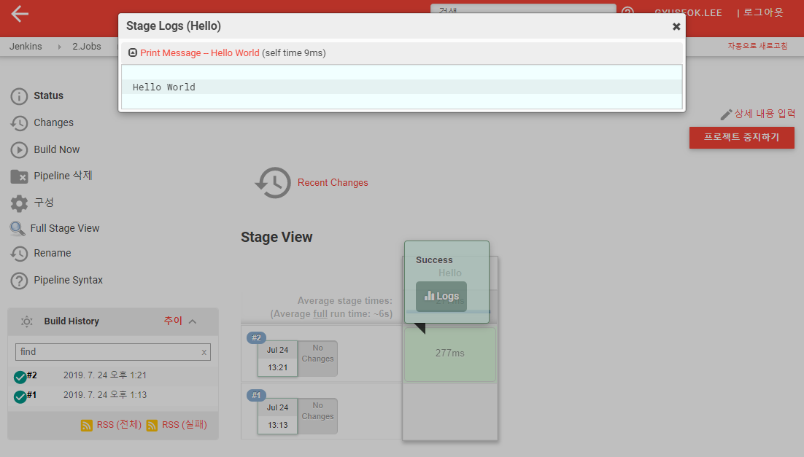
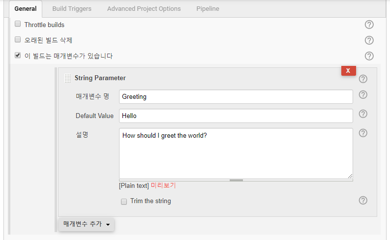
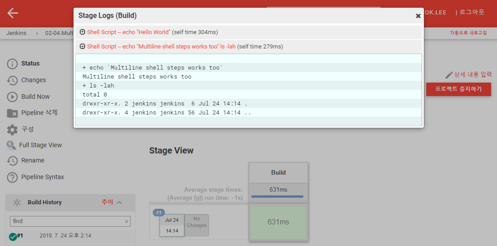

# 2. Jobs

프로젝트는 Job의 일부 입니다. 즉, 모든 프로젝트가 Job이지만 모든 Job이 프로젝트는 아닙니다. Job의 구조는 다음과 같습니다.

```mermaid
graph LR
    A(Job) -->B(AbstractProject)
    B --> F(MatrixProject)
    B --> G(Project)
    G --> H(FreeStyleProject)
    G --> I(MatrixConfigurationProject)
    A --> C(StubJob)
    A --> D(ViewJob)
    D --> E(ExternalJob)
```

FreeStyleProejct, MatrixProject, ExternalJob만 `New job`에 표시됩니다.

## 2.1 New pipeline

Step 1에서는 `stage`없이 기본 Pipeline을 실행하여 수행 테스트를 합니다.

1. Jenkins 로그인

2. 좌측 `새로운 Item` 클릭

3. `Enter an item name`에 Job 이름 설정 (e.g. 2.Jobs)

4. `Pipeline` 선택 후 `OK` 버튼 클릭

5. `Pipeline` 항목 오른 쪽 `Try sample Pipelie...`클릭하여 `Hello world` 클릭 후 저장

   ```groovy
   node {
      echo 'Hello World'
   }
   ```

6. 좌측 `Build now`클릭

7. 좌측 `Build History`의 최근 빌드된 항목(e.g. #1) 우측에 마우스를 가져가면 dropdown 버튼이 생깁니다. 해당 버튼을 클릭하여 `Console Output` 클릭

8. 수행된 `echo` 동작 출력을 확인합니다.

   ```
   Started by user GyuSeok.Lee
   Running in Durability level: MAX_SURVIVABILITY
   [Pipeline] Start of Pipeline
   [Pipeline] node
   Running on Jenkins in /var/lib/jenkins/workspace/2.Jobs
   [Pipeline] {
   [Pipeline] echo
   Hello World
   [Pipeline] }
   [Pipeline] // node
   [Pipeline] End of Pipeline
   Finished: SUCCESS
   ```

   

## 2.2 New pipeline

Step 2에서는 `stage` 를 구성하여 실행합니다.

1. 기존 생성한 Job 클릭 (e.g. 02-02.Jobs)

2. 좌측 `구성`을 클릭하여 `Pipeline` 스크립트를수정합니다.

   ```groovy
   pipeline{
       agent any
       stages {
           stage("Hello") {
               steps {
                   echo 'Hello World'
               }
           }
       }
   }
   ```

3. 수정 후 좌측 `Build Now`를 클릭하여 빌드 수행 후 결과를 확인합니다.

4. `Step 1`에서의 결과와는 달리 `Stage View`항목과 Pipeline stage가 수행된 결과를 확인할 수 있는 UI가 생성됩니다.

   

5. 수행된 빌드의 `Console Output`을 확인하면 앞서 `Step 1`에서는 없던 stage 항목이 추가되어 수행됨을 확인 할 수 있습니다.

   ```
   Started by user GyuSeok.Lee
   Running in Durability level: MAX_SURVIVABILITY
   [Pipeline] Start of Pipeline
   [Pipeline] node
   Running on Jenkins in /var/lib/jenkins/workspace/2.Jobs
   [Pipeline] {
   [Pipeline] stage
   [Pipeline] { (Hello)
   [Pipeline] echo
   Hello World
   [Pipeline] }
   [Pipeline] // stage
   [Pipeline] }
   [Pipeline] // node
   [Pipeline] End of Pipeline
   Finished: SUCCESS
   ```


## 2.3 Parameterizing a job

Pipeline 내에서 사용되는 매개변수 정의를 확인해 봅니다. Pipeline 스크립트는 다음과 같습니다.

```groovy
pipeline {
    agent any
    parameters {
        string(name: 'Greeting', defaultValue: 'Hello', description: 'How should I greet the world?')
    }
    stages {
        stage('Example') {
            steps {
                echo "${params.Greeting} World!"
            }
        }
    }
}
```

`parameters`항목내에 매개변수의 데이터 유형(e.g. string)을 정의합니다. `name`은 값을 담고있는 변수이고 `defaultValue`의 값을 반환합니다. Pipeline에 정의된 `parameters`는 `params`내에 정의 되므로 `${params.매개변수이름}`과 같은 형태로 호출 됩니다.

저장 후 다시 `구성`을 확인하면 `이 빌드는 매개변수가 있습니다`가 활성화 되고 내부에 추가된 매개변수 항목을 확인 할 수 있습니다.



이렇게 저장된 Pipeline Job은 매개변수를 외부로부터 받을 수 있습니다. 따라서 좌측의 기존 `Build Now`는 `build with Parameters`로 변경되었고, 이를 클릭하면 Greeting을 정의할 수 있는 UI가 나타납니다. 해당 매개변수를 재정의 하여 빌드를 수행할 수 있습니다.


## 2.4 Creating multiple steps for a job

다중스텝을 위한 Pipeline 타입의 Item을 추가로 생성합니다. (e.g. 02-04.MultiStep)

Pipeline에 다음과 같이 스크립트를 추가합니다.

```groovy
pipeline {
    agent any
    stages {
        stage('Build') {
            steps {
                sh 'echo "Hello World"'
                sh '''
                    echo "Multiline shell steps works too"
                    ls -lah
                '''
            }
        }
    }
}
```

`'''`은 스크립트 정의 시 여러줄을 입력할 수 있도록 묶어주는 역할을 합니다.  해당 스크립트에서는 `sh`로 구분된 스크립트 명령줄이 두번 수행됩니다.



실행되는 여러 스크립트의 수행을 `stage`로 구분하기위해 기존 Pipeline 스크립트를 다음과 같이 수정합니다.

```groovy
pipeline {
    agent any
    stages {
        stage('Build-1') {
            steps {
                sh 'echo "Hello World"'
            }
        }
        stage('Build-2') {
            steps {
                sh '''
                    echo "Multiline shell steps works too"
                    ls -lah
                '''
            }
        }
    }
}
```

stage를 구분하였기 때문에 각 실행되는 `sh` 스크립트는 각 스테이지에서 한번씩 수행되며, 이는 빌드의 결과로 나타납니다.


## 2.5 Adding scripts as a job step

Pipeline의 step을 추가하여 결과를 확인하는 과정을 설명합니다. 피보나치 수열을 수행하는 쉘 스크립트를 시간제한을 두어 수행하고 그 결과를 확인합니다.

Jenkins가 설치된 서버에 [피보나치 수열]([https://namu.wiki/w/%ED%94%BC%EB%B3%B4%EB%82%98%EC%B9%98%20%EC%88%98%EC%97%B4](https://namu.wiki/w/피보나치 수열))을 수행하는 스크립트를 작성합니다. Sleep이 있기 때문에 일정 시간 이상 소요 됩니다.

```bash
$ mkdir -p /var/jenkins_home/scripts
$ cd /var/jenkins_home/scripts
$ vi ./fibonacci.sh
#!/bin/bash
N=${1:-10}

a=0
b=1

echo "The Fibonacci series is : "

for (( i=0; i<N; i++ ))
do
    echo "$a"
    sleep 2
    fn=$((a + b))
    a=$b
    b=$fn
done
# End of for loop

$ chown -R jenkins /var/jenkins_home/
$ chmod +x /var/jenkins_home/scripts/fibonacci.sh
```


다중스텝을 위한 Pipeline 타입의 Item을 추가로 생성합니다. (e.g. 02-05.AddingStep)

Pipeline에 다음과 같이 스크립트를 추가합니다.

```groovy
pipeline {
    agent any
    stages {
        stage('Deploy') {
            steps {
                timeout(time: 1, unit: 'MINUTES') {
                    sh '/var/jenkins_home/scripts/fibonacci.sh 5'
                }
                timeout(time: 1, unit: 'MINUTES') {
                    sh '/var/jenkins_home/scripts/fibonacci.sh 32'
                }
            }
        }
    }
}
```

`steps`에 스크립트를 `timeout`이 감싸고 있으며, 각 스크립트의 제한시간은 1분입니다. 빌드를 수행하면 최종적으로는 `aborted`, 즉 중단됨 상태가 되는데 그 이유는 빌드 기록에서 해당 빌드를 클릭하면 확인 가능합니다.

- `Build History`에서 최신 빌드를 클릭합니다.

- 좌측 `Pipeline Steps`를 클릭하면 Pipeline 수행 스텝을 확인할 수 있습니다.

- 첫번째로 나타나는 `/var/jenkins_home/scripts/fibonacci.sh 5` 를 수행하는 `Shell Script`의 콘솔창 버튼을 클릭하면 잘 수행되었음을 확인 할 수 있습니다.

- 두번째로 나타나는 `/var/jenkins_home/scripts/fibonacci.sh 32` 를 수행하는 `Shell Script`의 콘솔창 버튼을 클릭하면 다음과 같이 중도에 프로세스를 중지한 것을 확인 할 수 있습니다.

  ```
  + /var/jenkins_home/scripts/fibonacci.sh 32
  The Fibonacci series is : 
  0
  1
  1
  2
  3
  ...
  317811
  514229
  Sending interrupt signal to process
  /var/jenkins_home/scripts/fibonacci.sh: line 16: 13543 Terminated              sleep 2
  832040
  /var/lib/jenkins/workspace/02-05.AddingStep@tmp/durable-e44bb232/script.sh: line 1: 13109 Terminated              /var/jenkins_home/scripts/fibonacci.sh 32
  script returned exit code 143
  ```