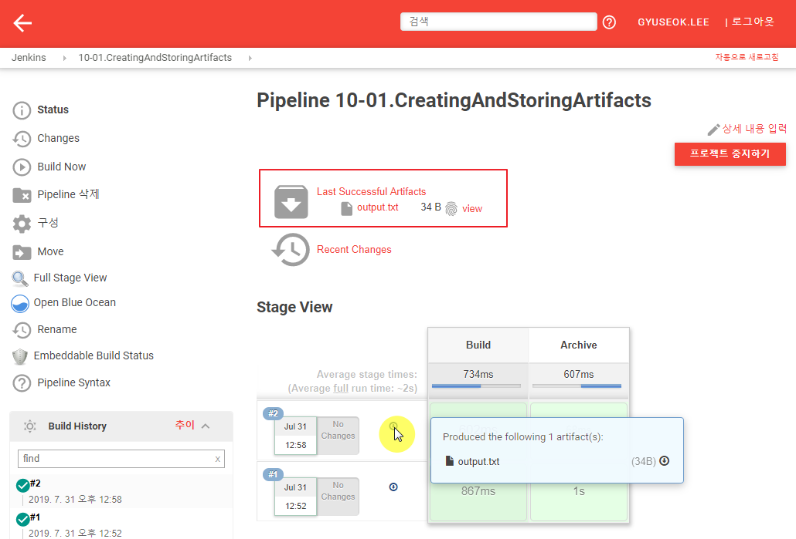
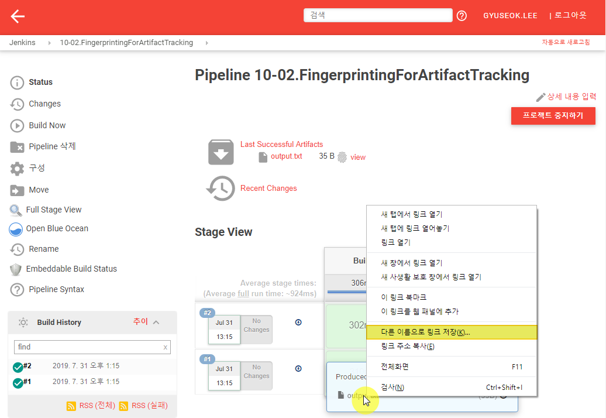

# 10. Artifacts

빌드 이후 빌드의 결과를 기록하고 저장하는 방법을 설명합니다.

## 10.1 Creating and storing artifacts

Pipeline 타입의 Item을 추가로 생성합니다. (e.g. 10-01.CreatingAndStoringArtifacts)

Pipeline에 다음과 같이 스크립트를 추가합니다.

```groovy
pipeline {
    agent any
    stages{
        stage('Build') {
            steps{
                sh 'echo "Generating artifacts for ${BUILD_NUMBER}" > output.txt'
            }
        }
        stage('Archive') {
            steps {
                archiveArtifacts artifacts: 'output.txt', onlyIfSuccessful: true
            }
        }
    }
}
```

`Archive` Stage에 `archiveArtifacts` 스크립트가 동작하는 예제입니다. 이같은 Pipeline 스크립트 작성을 도와주는 툴을 추가로 확인해 봅니다. 

- Pipeline 하단의 `Pipeline Syntax` 링크를 클릭합니다.
  
- `Sample Step`에서 `archiveArtifacts: Archive the artifacts`를 선택합니다.
  - Files to archive : output.txt
  - `고급...`을 클릭합니다.
  - 다음 항목을 활성화 합니다.
    - Archive artifacts only if build is successful
    - Use default excludes
    - Treat include and exclude patterns as case sensitive
  - 하단의 `GENERATE PIPELINE SCRIPT`를 클릭합니다.


결과물을 확인하면 Pipeline 스크립트에 작성한 형태와 같은 것을 확인 할 수 있습니다.


좌측 메뉴의 `Build Now`를 클릭하여 빌드 수행 후에 화면에 Artifacts 항목이 추가된 것을 확인할 수 있습니다. UI 상에는 마지막 빌드 결과가 강조되어 나오고 각 빌드에 대한 결과물은 각각의 빌드단계의 다운로드 버튼으로 확인하고 다운로드 할 수 있습니다.




## 10.2. Fingerprinting for artifact tracking

빌드 이후 보관되는 파일에 대해 어떤 프로젝트, 어떤 빌드 에서 발생한 결과물인지 확인할 수 있는 핑거프린팅 기능을 설명합니다.

`Step 1`의 프로젝트를 그대로 사용하거나 Pipeline 타입의 Item을 추가로 생성합니다. (e.g. 10-02.FingerprintingForArtifactTracking)

`Step 1` Pipeline 스크립트의 `archiveArtifacts`에 `fingerprint: true`를 추가합니다.

```groovy
pipeline {
    agent any
    stages{
        stage('Build') {
            steps{
                sh 'echo "Generating text artifacts: Build:${BUILD_NUMBER}" > output.txt'
            }
        }
        stage('Archive') {
            steps {
                archiveArtifacts artifacts: 'output.txt', fingerprint: true, onlyIfSuccessful: true
            }
        }
    }
}
```


파일의 지문을 확인합니다.

- 첫번째 빌드를 수행하고 빌드 결과 아카이브 파일 `output.txt`파일을 다운로드 받습니다. (파일을 우클릭하고 `다른 이름으로 링크 저장...` or `Download Linked File` 을 클릭하여 파일을 받습니다.)
  

- 좌측 상단의 `Jenkins`를 클릭하여 최상위 메뉴로 돌아갑니다.
- 좌측 메뉴의 `파일 핑거프린트 확인`을 클릭합니다.
- `파일 선택`버튼을 클릭하여 앞서 다운로드한 파일을 선택하고 `확인하기`버튼을 클릭합니다.
- 어떤 프로젝트의 몇번째 빌드에서 발생한 파일인지 확인합니다.
- 두번째 빌드를 수행하고 파일 핑거프린트를 확인해 봅니다.
- 빌드 번호 정보가 변경된 것을 확인합니다.